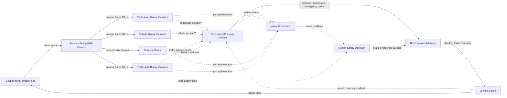

# Control Structure Diagram

```mermaid
flowchart LR
    ENV[Environment / Urban Road]
    CAM[Forward-facing RGB Camera]

    PED[Pedestrian Binary Classifier]
    VEH[Vehicle Binary Classifier]
    TL[Traffic-light Binary Classifier]
    DIST[Distance Oracle]

    PLAN[Rule-based Planning Module]
    ACT[Drive-by-wire Actuators]
    MOTION[Vehicle Motion]

    DASH[Visual Dashboard]
    HUMAN[Human Safety Operator]

    ENV -->|visual scene| CAM

    CAM -->|camera frame 10 Hz| PED
    CAM -->|camera frame 10 Hz| VEH
    CAM -->|camera frame 10 Hz| TL
    CAM -->|detected object input| DIST

    PED -.->|pedestrian present?| PLAN
    VEH -.->|vehicle present?| PLAN
    TL -.->|traffic light present?| PLAN
    DIST -.->|distance estimate| PLAN
    MOTION -.->|speed / steering feedback| PLAN

    PLAN -->|continue / decelerate / emergency brake| ACT
    ACT -->|throttle / brake / steering| MOTION
    MOTION -->|vehicle state| ENV

    PLAN -.->|system status| DASH
    PED -.->|perception output| DASH
    VEH -.->|perception output| DASH
    TL -.->|perception output| DASH
    DASH -.->|visual feedback| HUMAN
    ENV -.->|road observation| HUMAN

    HUMAN -->|brake or steering override| ACT
```

Solid arrows are control actions or physical process flows. Dashed arrows represent feedback/information flows.
